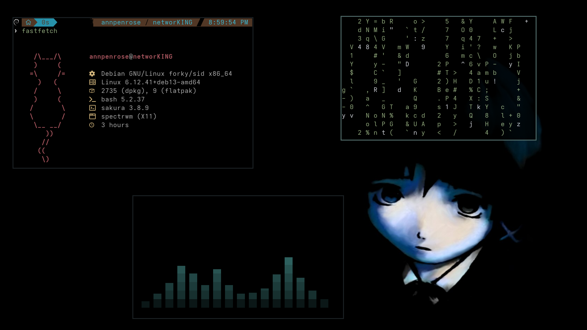
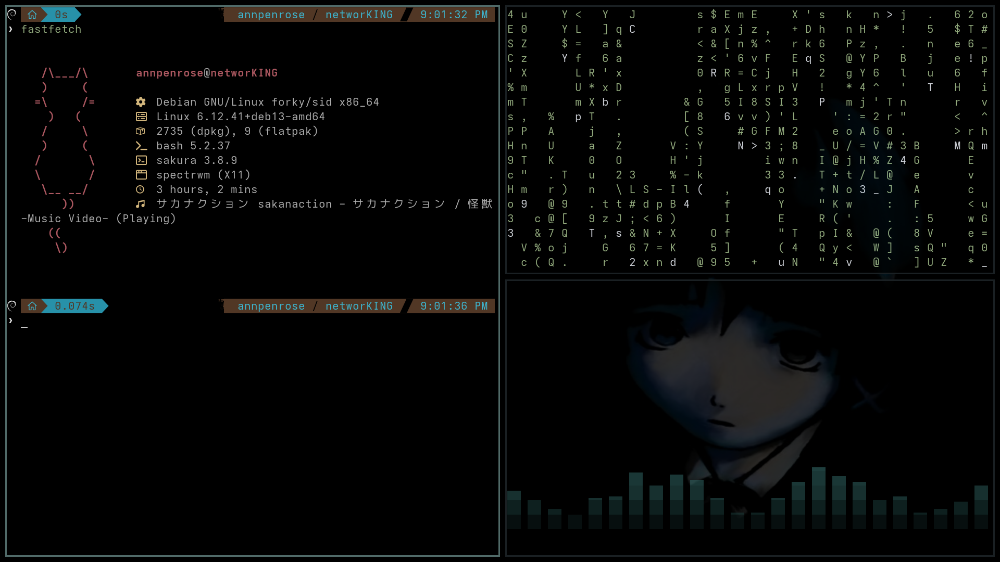
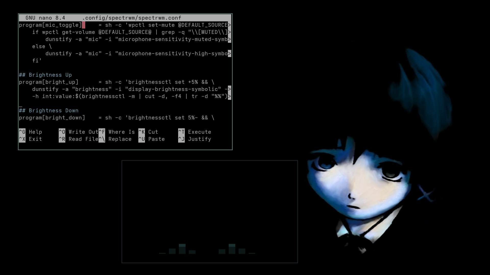

# Spectr.Debian.Files

> My personal Squared themed Debian desktop dotfiles, featuring the minimalist and dynamic tiling window manager, Spectrwm.

---
## Components

| Component | Description |
|-----------|-------------|
| Spectrwm  | A minimalist tiling window manager for X11, inspired by xmonad and dwm. |
| Picom     | A lightweight compositor for X11, used for transparency and shadow effects. |
| Rofi      | A versatile window switcher, application launcher, and dmenu replacement. |
| Dunst     | A lightweight and customizable notification daemon. |
| Conky     | A light-weight system monitor for X that displays information on your desktop. |
| Fastfetch | A fast system fetch tool with custom ASCII/logo. |
| Cava      | A terminal-based audio visualizer. |
| btop      | A modern and interactive resource monitor. |
| Kvantum   | An SVG-based theme engine for Qt5/6 and KDE. |

---
## System Info

| Type             | Details                               |
|------------------|---------------------------------------|
| **Distro** | Debian                                |
| **Window Manager**| Spectrwm                              |
| **Display Server**| X11                                   |
| **Terminal** | Sakura                                 |
| **Font** | JetBrainsMono NF, AdwaitaMono NF, Ubuntu NF, Iosevka NF          |
| **Shell** | Bash                                   |
| **Bar** | No bar. Bar is overrated               |
| **Theme** | Squared            |
| **Icon** | GreyStone            |
| **Cursor** | MogaGrey               |

---
## More Screenshot(s)

---
## License

This project is licensed under the  - see the [LICENSE](LICENSE) file for details.

---
